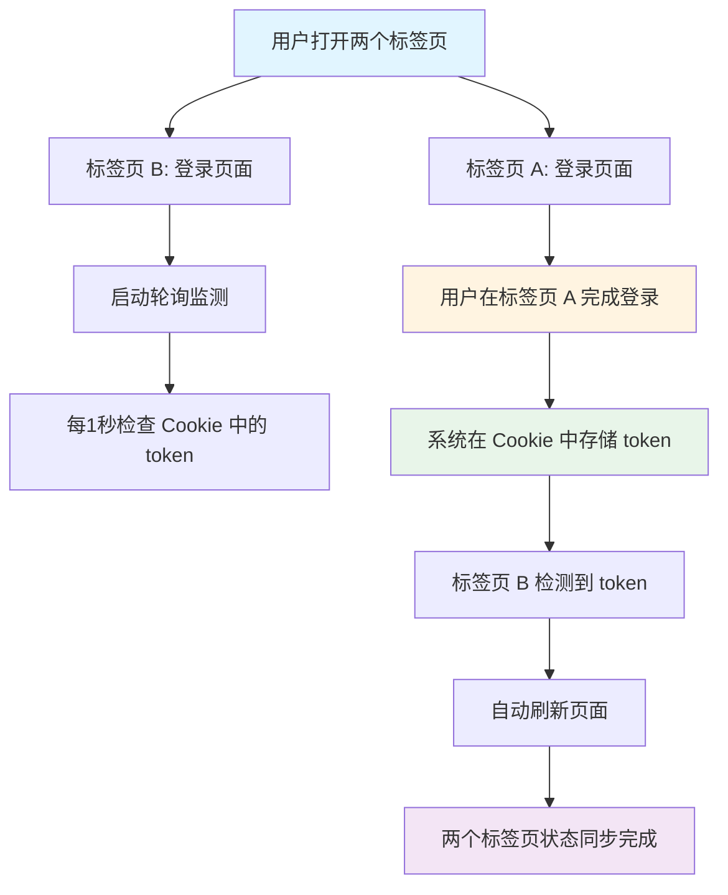
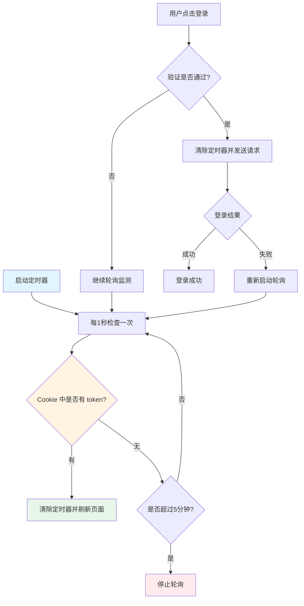

# 多标签页登录状态同步：一个简单而有效的解决方案

## 前言

在现代 Web 应用中，用户经常会打开多个浏览器标签页。当用户在其中一个标签页完成登录后，其他标签页如何自动同步登录状态，是一个常见但容易被忽视的问题。本文将分享我们在微服务架构的授权中心中，如何通过一个简单而优雅的方案解决这个问题。

## 问题场景

想象这样一个场景：
你正在使用一个需要登录的 Web 应用，同时打开了两个标签页。在第一个标签页（标签页 A）输入账号密码，点击登录，系统提示"登录成功"。此时你切换到第二个标签页（标签页 B），发现页面仍然显示登录表单。
你可能会想："我已经在标签页 A 登录了，为什么标签页 B 还是显示未登录？"于是你在标签页 B 再次点击登录按钮。

**问题来了**：

1.  标签页 B 的登录请求可能使用的是旧的 token，导致登录状态异常
2.  新登录可能会挤掉标签页 A 的登录状态
3.  即使登录成功，由于使用了旧的 token，最终还是被重定向回登录页
4.  两个标签页的登录状态无法同步，用户体验很差

这就是我们遇到的问题：**多标签页之间的登录状态无法实时同步**。

## 问题根源

在微服务架构中，我们的授权中心负责用户登录认证。登录成功后，系统会在 Cookie 中存储 token。但是，当用户在标签页 A 登录后，标签页 B 并不知道 Cookie 中已经有了 token，因为：

1.  **缺乏实时监测机制**：登录页面没有实时监测 Cookie 中 token 的变化
2.  **状态不同步**：多个标签页之间的 token 状态无法实时同步
3.  **重复登录冲突**：在已有 token 的情况下仍可重复登录，导致登录状态冲突

## 解决方案

### 核心思路

我们的解决方案非常简单：**在登录页面启动一个定时器，每秒检查一次 Cookie 中是否存在 token。如果检测到 token，就自动刷新页面**。

这样，当用户在标签页 A 登录后，标签页 B 会在 1 秒内检测到 Cookie 中的 token，然后自动刷新页面，加载最新的登录状态。

### 实现方案

#### 1. 轮询监测机制

在登录页面挂载时，启动一个定时器，每秒检查一次 Cookie 中的 token：

```typescript
// 启动 token 轮询定时器
const startTokenPolling = () => {
  tokenPollingTimer.value = window.setInterval(() => {
    const token = Store.get_cookie('token')

    if (token) {
      // 检测到 token，刷新页面
      clearTokenPolling()
      window.location.reload()
      return
    }

    // 超过 5 分钟未检测到 token，停止轮询
    if (tokenPollingElapsed.value >= 300) {
      clearTokenPolling()
    }
  }, 1000) // 每 1 秒执行一次
}
```

**关键设计点**：

*   **轮询频率**：1 秒一次，既能及时检测到变化，又不会造成性能问题
*   **超时保护**：5 分钟后自动停止，避免无限轮询
*   **自动刷新**：检测到 token 后立即刷新页面，用户无感知

#### 2. 智能的定时器管理

我们不是简单地"点击登录就清除定时器"，而是采用了更智能的策略：

**只在真正发送登录请求时清除定时器**

```typescript
// 通过所有验证后，准备发送登录请求时才清除定时器
if (/* 所有验证通过 */) {
  clearTokenPolling() // 清除定时器
  // 发送登录请求
}
```

这样设计的好处是：如果用户点击登录但验证失败（比如协议未勾选），页面仍停留在登录页，定时器会继续工作，继续监测其他标签页的登录状态。

**登录失败后重新启动轮询**

如果登录失败，用户仍停留在登录页面，此时会重新启动轮询：

```typescript
// 登录失败后
if (loginFailed) {
  startTokenPolling() // 重新启动轮询
}
```

这样确保用户在登录失败后，仍能自动同步其他标签页的登录状态。

#### 3. 401 异常时的状态同步

当后端返回 401 未授权错误时（通常表示 token 已过期），除了清除 localStorage 中的 token，我们也会同步清除 Cookie 中的 token：

```typescript
case 401:
    store.remove('token')
    store.clear_cookie('token') // 同步清除 Cookie
    break
```

这确保了当 token 失效时，轮询机制不会误判已登录状态。

## 工作流程

让我们通过流程图来理解整个方案：

### 多标签页同步流程



### 轮询检测逻辑



## 方案优势

1.  **简单有效**：实现简单，代码量少，但能有效解决问题
2.  **用户体验好**：自动同步，用户无感知，无需手动刷新
3.  **资源可控**：5 分钟超时保护，避免无限轮询
4.  **智能管理**：只在必要时清除定时器，验证失败时继续工作
5.  **失败恢复**：登录失败后自动恢复轮询，确保状态同步

## 实际效果

实施这个方案后，我们解决了以下问题：

*   ✅ 用户在标签页 A 登录后，标签页 B 会在 1 秒内自动刷新并同步登录状态
*   ✅ 避免了重复登录导致的 token 冲突问题
*   ✅ 提升了用户体验，无需手动刷新页面
*   ✅ 登录失败后仍能继续监测其他标签页的登录状态

## 技术细节

### 定时器管理

*   使用 `setInterval` 创建定时器，存储定时器 ID
*   组件卸载时清除定时器，防止内存泄漏
*   避免重复创建定时器（检查定时器是否已存在）

### Cookie 操作

*   登录成功后通过 `set_cookie` 将 token 存入 Cookie
*   轮询时通过 `get_cookie` 读取 Cookie 中的 token
*   401 异常时通过 `clear_cookie` 清除 Cookie 中的 token

### 生命周期管理

```typescript
onMounted(() => {
  startTokenPolling() // 页面挂载时启动轮询
})

onBeforeUnmount(() => {
  clearTokenPolling() // 组件卸载时清除定时器
})
```

## 注意事项

1.  **Cookie 作用域**：确保 Cookie 的 `domain` 设置正确，多个标签页能够共享同一 Cookie
2.  **轮询频率**：1 秒一次是平衡及时性和性能的折中选择，可根据实际需求调整
3.  **超时时间**：5 分钟的超时保护可根据业务场景调整
4.  **性能影响**：定时器会增加一定的性能开销，但影响很小（每 1 秒执行一次简单判断）

## 总结

这个方案通过简单的轮询机制，优雅地解决了多标签页登录状态同步的问题。虽然轮询不是最高效的方式，但在实际应用中，它简单、可靠、易于维护，是一个很好的折中选择。

### 为什么选择轮询方案？

我们选择轮询方案主要基于以下考虑：

1.  **兼容性优先**：轮询方案在所有浏览器中都能正常工作，包括 IE，无需担心兼容性问题
2.  **实现简单**：代码逻辑清晰，易于理解和维护，团队协作成本低
3.  **稳定可靠**：不依赖特定的浏览器 API，减少了潜在的失败点
4.  **性能可接受**：虽然每秒执行一次，但只是简单的 Cookie 检查，性能影响很小

### 更优方案：BroadcastChannel API

如果你追求更好的性能和实时性，可以考虑使用 `BroadcastChannel API`。这是一个更优雅的解决方案。

#### BroadcastChannel 的优势

`BroadcastChannel` 允许同源的不同标签页之间进行消息通信，相比轮询方案有以下优势：

1.  **实时性更好**：事件驱动，无需等待轮询间隔，检测到 token 后立即响应
2.  **性能更优**：无持续 CPU 开销，只在事件触发时执行，资源消耗更低
3.  **代码更简洁**：无需定时器和超时处理逻辑，代码量更少

#### 实现示例

使用 BroadcastChannel 的实现非常简单：

**登录成功后发送消息**：

```typescript
// 登录成功后
if (typeof BroadcastChannel !== 'undefined') {
    const channel = new BroadcastChannel('token-sync')
    channel.postMessage({ type: 'TOKEN_AVAILABLE' })
    channel.close()
}
```

**登录页面监听消息**：

```typescript
const channel = new BroadcastChannel('token-sync')

channel.onmessage = (event) => {
    if (event.data.type === 'TOKEN_AVAILABLE') {
        // 收到其他标签页登录消息，刷新页面
        channel.close()
        window.location.reload()
    }
}
```

就这么简单！无需定时器，无需轮询，代码更清晰。

#### 方案对比

| 特性        | 轮询方案（当前） | BroadcastChannel |
| --------- | -------- | ---------------- |
| **实时性**   | 最多 1 秒延迟 | 即时响应             |
| **性能**    | 每秒执行一次   | 事件触发，无持续开销       |
| **浏览器支持** | 所有浏览器    | 现代浏览器（IE 不支持）    |
| **代码复杂度** | 简单       | 更简单              |

#### 混合方案（推荐）

如果你既想要 BroadcastChannel 的性能优势，又需要兼容旧浏览器，可以采用混合方案：

```typescript
const setupTokenSync = () => {
  if (typeof BroadcastChannel !== 'undefined') {
    // 使用 BroadcastChannel
    const channel = new BroadcastChannel('token-sync')
    channel.onmessage = (event) => {
      if (event.data.type === 'TOKEN_AVAILABLE') {
        window.location.reload()
      }
    }

    // 作为降级，每 5 秒检查一次 Cookie（防止消息丢失）
    setInterval(() => {
      if (Store.get_cookie('token')) {
        window.location.reload()
      }
    }, 5000)
  } else {
    // 降级到轮询方案
    startTokenPolling()
  }
}
```

这样，现代浏览器享受 BroadcastChannel 的性能优势，旧浏览器自动降级到轮询方案，既保证了性能，又保证了兼容性。

### 其他优化方向

1.  **服务端推送**：如果后端支持 WebSocket，可以通过服务端推送来实现更实时的状态同步
2.  **用户体验优化**：可以在检测到 token 后，先显示一个"正在同步登录状态..."的提示，再刷新页面
3.  **动态轮询频率**：可以根据时间动态调整轮询频率，比如前 1 分钟每秒检查，之后降低频率

### 适用场景

这个方案特别适合：

*   微服务架构中的授权中心
*   需要多标签页状态同步的 Web 应用
*   对实时性要求不是特别高的场景（1 秒延迟可接受）

如果你的应用主要面向现代浏览器用户，建议考虑 BroadcastChannel 方案；如果需要兼容旧浏览器，轮询方案或混合方案都是不错的选择。

希望这个方案能对遇到类似问题的开发者有所帮助。如果你有更好的想法或建议，欢迎交流讨论！

***

**相关技术栈**：Vue 3、TypeScript、Axios、微前端
